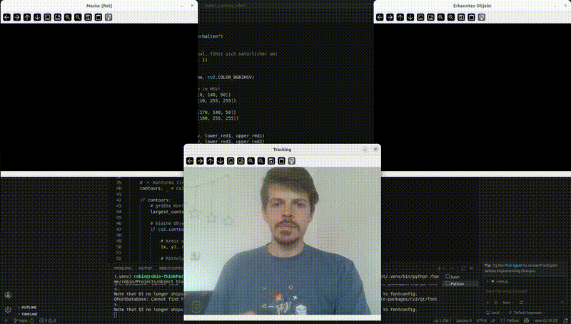

# 🟥 Real-Time Object Following Robot (OpenCV, Python)

A minimal robotics prototype that detects a colored object in a webcam feed, tracks its position, and simulates movement decisions (left/right/forward).

Built as a fast, practical introduction to perception-driven robotics systems.

---

## 🚀 Project Goal

Implement a simple **perception → decision pipeline**:

* Detect an object using color segmentation (HSV)
* Compute its position in image space
* Simulate robot movement based on object location

---

## 🧠 Tech Stack

* Python
* OpenCV
* NumPy

---

## 📸 Features

* Real-time webcam processing
* Robust color detection using HSV color space
* Object tracking via contour detection
* Center point (centroid) calculation using image moments
* Visual feedback:

  * Bounding circle
  * Center point
  * Tracking coordinates
* Movement simulation:

  * LEFT / RIGHT / FORWARD decision logic

---

## 🛠️ Installation

```bash
git clone <your-repo-url>
cd object-following-robot

pip install -r requirements.txt
```

---

## ▶️ Run

```bash
python main.py
```

Press `ESC` to exit.

---

## ⚙️ How It Works

### 1. Color Detection

* Convert frame from BGR → HSV
* Apply threshold to isolate red regions
* Generate binary mask

### 2. Object Tracking

* Extract contours from mask
* Select largest contour
* Compute:

  * enclosing circle
  * centroid via image moments

### 3. Decision Logic

Based on object position:

* LEFT → object is left of center
* RIGHT → object is right of center
* FORWARD → object is centered

---

## 🧪 Example Use

Hold a red object (e.g. a cup or ball) in front of your webcam.

You will see:

* A circle around the object
* A dot marking its center
* Live coordinates
* Simulated movement direction

---

## 📊 System Pipeline

```
Camera → Color Segmentation → Contour Detection → Centroid → Decision Logic
```

## Demo



---

## 🧩 Key Concepts Demonstrated

* Image processing with OpenCV
* HSV color space vs RGB
* Contour-based object detection
* Centroid calculation using moments
* Basic control logic in robotics

---

## 🧪 Next Steps

* [ ] Add distance estimation (based on object size)
* [ ] Smooth movement (reduce jitter)
* [ ] Replace rule-based logic with PID controller
* [ ] Integrate with real hardware (e.g. Raspberry Pi + motors)
* [ ] Add ROS for modular system design

---

## 🎯 Why This Project Matters

This project demonstrates:

* Ability to build **end-to-end working systems**
* Understanding of **robot perception pipelines**
* Practical use of computer vision for control tasks
* Rapid prototyping skills

---

## 🧑‍💻 Author

Your Name

---

## 📄 License

MIT (or your choice)
